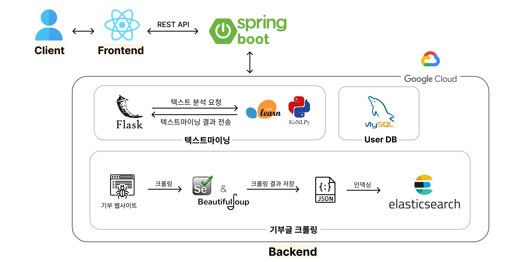

<h1 align="center"><strong>마</strong>음을 <strong>모</strong>두 <strong>모</strong>아, MaMoMo</h1>

<div align="center">
  :heartpulse::heartpulse::heartpulse::heartpulse::heartpulse:
</div>

<div align="center">
  <strong>HSU 2022 Capstone Project</strong>
</div>

<div align="center">
  따뜻한 세상을 위한 통합 기부 플랫폼
</div>

<div align="center">
  <h3>
    <a href="https://imshung.notion.site/MaMoMo-2195650e0c2d4c589aa8a32016fae4ea">
      📖 Wiki
    </a>
    <span> | </span>
    <a href="https://github.com/2E2I/mamomo-client">
      🌏 Frontend
    </a>
    <span> | </span>
    <a href="https://2e2i.github.io/mamomo-server/">
      📜 REST API Doucment
    </a>
  </h3>
</div>
<br>

## 🔖 목차

- [개요](https://github.com/2E2I/mamomo-server#-개요)
- [실행 및 설치 방법](https://github.com/2E2I/mamomo-server#-실행-및-설치-방법)
- [핵심 기능](https://github.com/2E2I/mamomo-server#-핵심-기능)
  * [기부 통합 검색 엔진](https://github.com/2E2I/mamomo-server#기부-통합-검색-엔진)
  * [배너 생성기](https://github.com/2E2I/mamomo-server#배너-생성기)
  * [텍스트 분석 기반 기부 추천](https://github.com/2E2I/mamomo-server#텍스트-분석-기반-기부-추천)
- [기술 스택](https://github.com/2E2I/mamomo-server#-기술-스택)
- [시스템 구조도](https://github.com/2E2I/mamomo-server#시스템-구조도)
- [주요 화면](https://github.com/2E2I/mamomo-server#-주요-화면)
- [팀 정보](https://github.com/2E2I/mamomo-server#-팀-정보)


## 📍 개요
최근 국내 온라인 기부가 증가하고 있는 추세이다. 하지만 기부 캠페인들이 해피빈, 카카오같이가치, 체리 등 많은 사이트에 흩어져 있어 원하는 기부를 찾기 번거롭다.
본 프로젝트는 이를 해결하기 위해 다양한 플랫폼의 기부 글을 크롤링 해 한곳에 모아 볼 수 있는 검색 엔진을 제공한다. 이와 더불어 기부 글 홍보를 효과적으로 할 수 있는 자동 배너 제작 기능과 텍스트 마이닝 기반 기부 추천 기능을 제공하는 통합 기부 플랫폼이다.

## 🏃 실행 및 설치 방법
1. 마모모 원격 저장소를 클론합니다.
   ```shell
   git clone https://github.com/2E2I/mamomo-server.git
   ```
2. 생성된 로컬 저장소로 이동 후 빌드
    ```shell
    /* windows */
    $ gradlew build

    /* linux */
    $ ./gradlew build
    ```
3. ./build/libs 에서 .jar파일 실행
   ```shell
   java -jar mamomo-0.0.1-SNAPSHOT.jar
   ```

## ✨ 핵심 기능

### 기부 통합 검색 엔진

- 기부 사이트들에서 크롤링 해 와 Elasticsearch에 인덱싱 합니다.
- 여러 사이트들을 방문할 필요 없이, 마모모에서 기부 관련 검색이 가능합니다.


### 배너 생성기
  
- 캠페인에서 배너 생성 버튼을 누르거나, 배너제작 페이지로 들어가 배너를 제작할 수 있습니다.
- 블로그, 기사에 관련 기부를 첨부해 보세요!
- 자유롭게 커스터마이징이 가능해 기부 관련 컨텐츠가 아니라도 배너를 만들 수 있습니다.
- 로그인 상태에서 만든 배너는 저장되며, 수정도 가능합니다.


### 텍스트 분석 기반 기부 추천
  - 텍스트를 삽입하면 주요 단어가 추출됩니다.
  - 그 중요도에 따라 가중치를 부여해 Elasticsearch에서 기부를 검색하고, 반환합니다.
  - 본인의 컨텐츠와 밀접한 기부캠페인을 추천 받을 수 있습니다.

## 📌 기술 스택
- Language:`Java` `JavaScript` `Python`
- Library & Framework: `Spring` `React` `Spring Data JPA` `Spring Data Elasticsearch` `Flask` `scikit-learn` `material UI`
- Database: `MySQL` `Elasticsearch`
- Target: `Web Browser`
- Tool: `IntelliJ` `VSCode`
- etc: `Spring Security` `Spring REST Docs` `Figma` `Notion` `Slack`

## 시스템 구조도




## 📸 주요 화면

<details>
  <summary>주요 화면 보기</summary>
  
  
  - 메인화면
  

  - 회원가입
  

  - 로그인
  

  - 검색
  

  - 검색 결과
  

  - 기부 모아
  

  - 기부 카드
  

  - 배너 모아
  

  - 배너 제작
  

  - 프로필 관리
  

  - 좋아요한 기부
  

  - 내가 만든 배너
  
  
  
</details>


## 👩‍👩‍👧‍👦 팀 정보

<div sytle="overflow:hidden;">
<table>
   <tr>
      <td colspan="2" align="center"><strong>Front-End Developer</strong></td>
      <td colspan="2" align="center"><strong>Back-End Developer</strong></td>
   </tr>
  <tr>
    <td align="center">
    <a href="https://github.com/ssw6750"><br /><sub><b>서석원</b></sub></a><br />
    </td>
     <td align="center">
        <a href="https://github.com/bobaej1n"><br /><sub><b>이혜진</b></sub></a>
     </td>
     <td align="center">
        <a href="https://github.com/im-shung"><br /><sub><b>임서영</b></sub></a>
     </td>
     <td align="center">
        <a href="https://github.com/devyuseon"><br /><sub><b>임유선</b></sub></a>
     </td>
  <tr>

</table>
</div>
